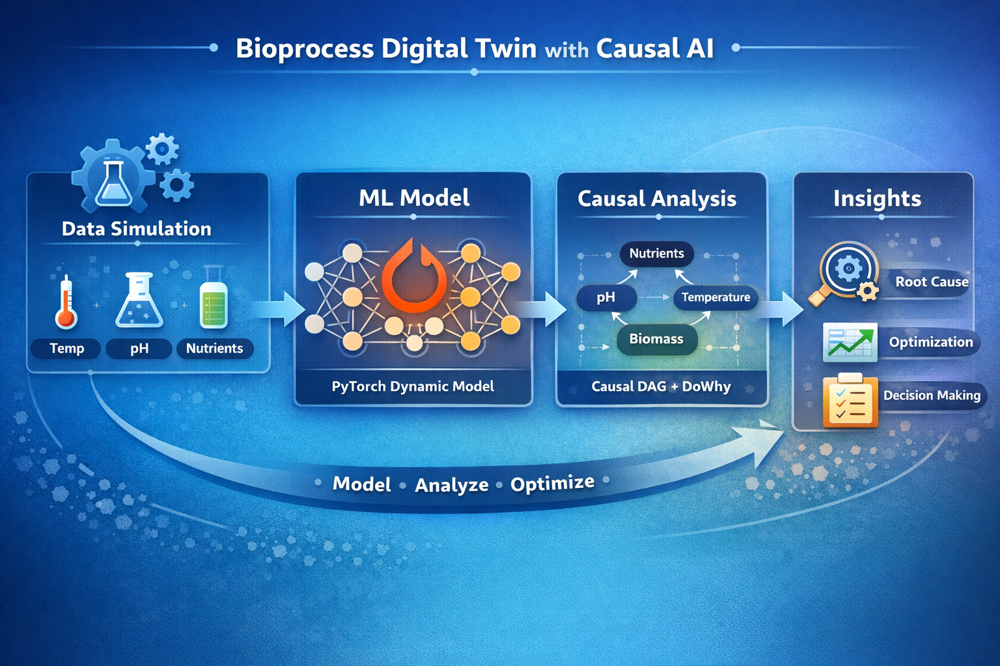
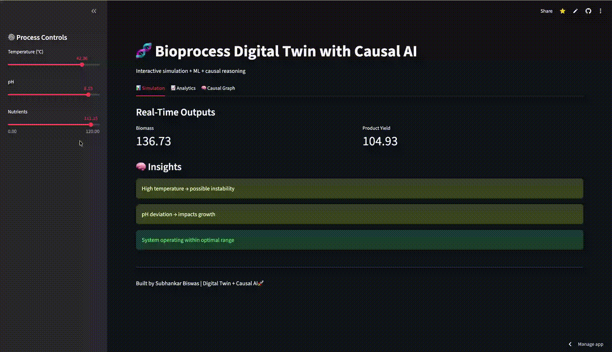

# 🧬 Bioprocess Digital Twin with Causal AI

[] (https://bioprocess-digital-twin-causal-ai-gja2c6jked4ve2upw7keha.streamlit.app/#insights)


---

## 🚀 Overview
This project implements a **Bioprocess Digital Twin** integrating:

- 🔁 Time-series simulation of a bioreactor system  
- 🤖 Deep learning using PyTorch  
- 🧠 Causal inference using DoWhy  

It models relationships between:
- Temperature  
- pH  
- Nutrients  
- Biomass  
- Product yield  

---

## 🧠 Architecture



---

## 🔬 Key Features

### 🧪 Digital Twin Simulation
- Synthetic bioprocess data generation  
- Time-dependent system dynamics  

### 🤖 Deep Learning Model
- PyTorch neural network  
- Predicts product yield  

### 🧬 Causal AI
- DAG-based causal modeling  
- Root cause analysis using DoWhy  

---

## 📊 Example Workflow

```bash
python src/simulation.py
python src/train.py
python src/causal.py

🛠 Tech Stack
Python
PyTorch
Pandas, NumPy
Scikit-learn
DoWhy
Streamlit

📈 Results
Captured process dynamics via ML
Identified causal impact of temperature on production
Simulated batch deviations

📌 Project Structure
bioprocess-digital-twin/
│── app/
├── data/
├── notebooks/
├── src/
├── diagrams/
├── requirements.txt
└── README.md

🎯 Relevance
✔ Digital Twin Modeling
✔ Bioprocess Data Science
✔ Causal AI for Root Cause Analysis
✔ Time-Series + High-Dimensional Data

---

## 🌐 Live Demo (Interactive Digital Twin)



👉 **Try the Streamlit App:**  
🔗 https://bioprocess-digital-twin-causal-ai-gja2c6jked4ve2upw7keha.streamlit.app/#insights

---

### 🎛️ Features

- Interactive control of:
  - Temperature  
  - pH  
  - Nutrient levels  
- Real-time prediction of:
  - Biomass  
  - Product yield  
- Dynamic process simulation  
- Rule-based insights for process stability  

---

### ▶️ Run Locally

```bash
pip install -r requirements.txt
streamlit run app/streamlit_app.py

🚀 Future Improvements
Real bioprocess datasets
Reinforcement learning optimization
Advanced causal discovery

👤 Author
Subhankar Biswas
MSc Data Engineering
GitHub: https://github.com/Subiswas36218/bioprocess-digital-twin-causal-ai